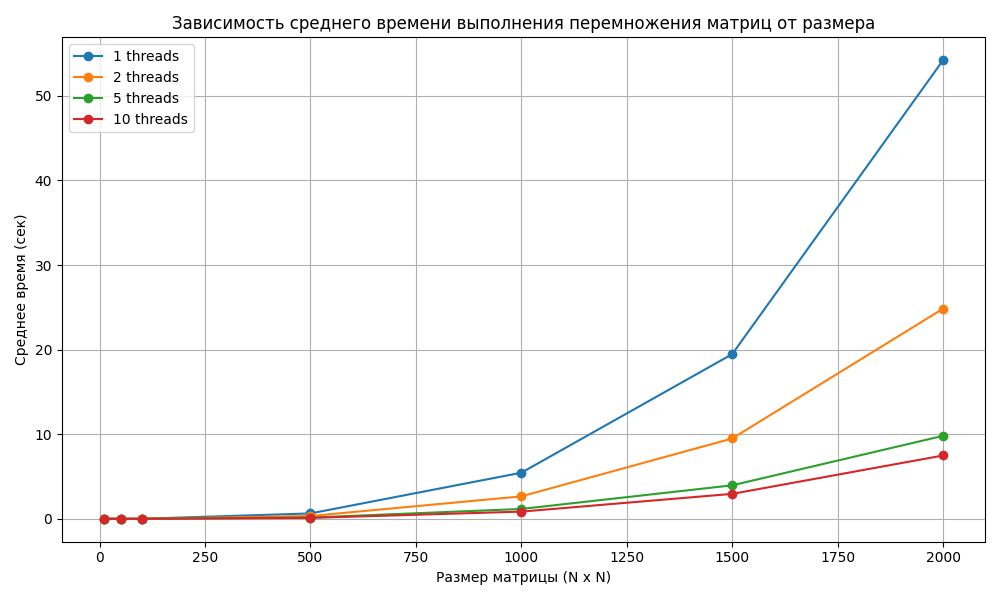

# Отчет по лабораторной работе №1

## Задание

Модифицировать программу из л/р №1 для параллельной работы по
технологии OpenMP.

## Описание работы

Данная программа реализует многопоточную параллельную обработку умножения матриц с использованием библиотеки OpenMP.

1. Были сгенерированы квадратные матрицы размером 10, 50, 100, 500, 1000, 1500, 2000 в нескольких экземплярах на каждый размер;

2. Произведено умножение ранее сгенерированных матриц с использованием OpenMP;

3. Вычисления выполняются параллельно с заданным количеством потоков: 1, 2, 5 и 10 ;

4. Результаты (размера матрицы и среднее время подсчета умножения) сохраняются в отдельные отчётные файлы (report_N.txt) где N - количество потоков;

5. Выполнена проверка на корректность результата с помощью Python путем сравнивания его с вычисленным с помощью NumPy значением. Результат проверки также записан в verification_report.txt.

## Результаты работы

Сравнение результатов умножения матриц: Для матриц всех размеров результаты C++ совпадают с NumPy, что подтверждает корректность вычислений.
### Один поток 
| Размер матрицы | Среднее время (мс) |
| ---------------- | ------------------- |
| 10 | 0.00 |
| 50 | 0.00 |
| 100 | 4.60 |
| 500 | 635.20 |
| 1000 | 5446.80 |
| 1500 | 19464.40 |
| 2000 | 54208.80 |
---
### Два потока 
| Размер матрицы | Среднее время (мс) |
| ---------------- | ------------------- |
|10 | 0.00 |
|50 | 0.00 |
|100 | 2.40 |
|500 | 330.00 |
|1000 | 2651.20 |
|1500 | 9494.80 |
|2000 | 24834.80 |
---
### Пять потоков 
| Размер матрицы | Среднее время (мс) |
|------------------|----------------------|
| 10 | 0.00 |
| 50 | 0.00 |
| 100 | 1.00 |
| 500 | 148.60 |
| 1000 | 1162.40 |
| 1500 | 3957.00 |
| 2000 | 9807.00 |
---
### Десять потоков 
| Размер матрицы | Среднее время (мс) |
|------------------|----------------------|
| 10 | 0.00 |
| 50 | 0.00 |
| 100 | 1.00 |
| 500 | 106.40 |
| 1000 | 848.60 |
| 1500 | 2946.80 |
| 2000 | 7484.60 |

### График зависимости времени выполнения умножения от размера матрицы:

## Вывод

Многопоточность (OpenMP) эффективно ускоряет перемножение матриц при достаточно больших размерах. Для малых матриц (до 100×100) прирост незаметен из-за накладных расходов, но с ростом размера увеличение числа потоков значительно снижает время выполнения(более чем в 2 раза)
